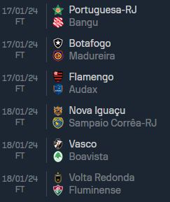
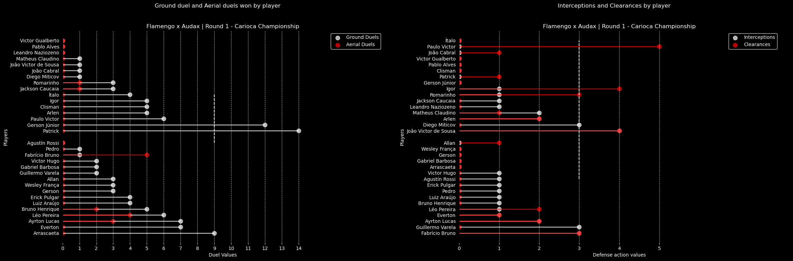
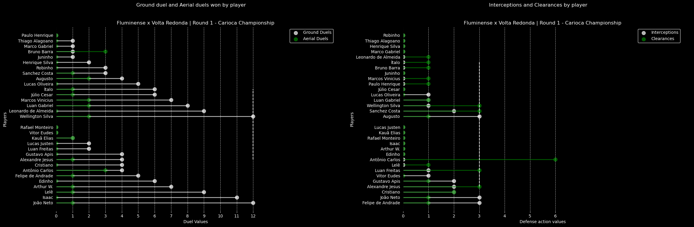
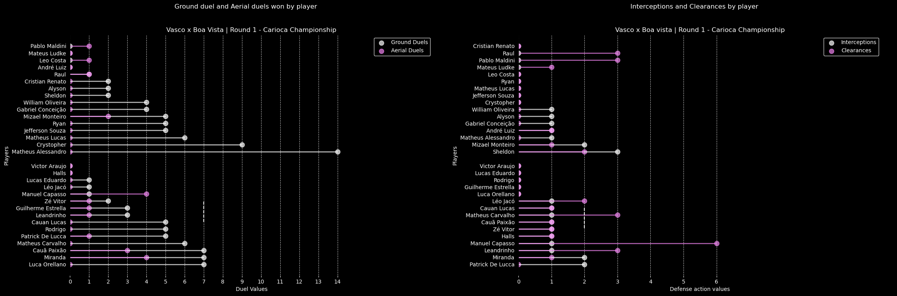
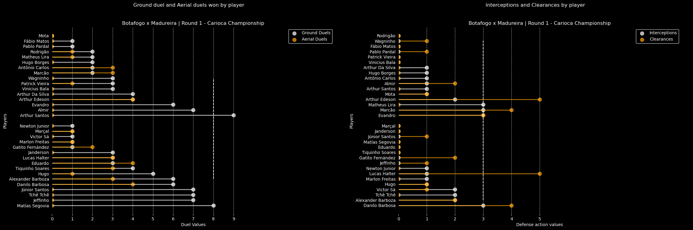
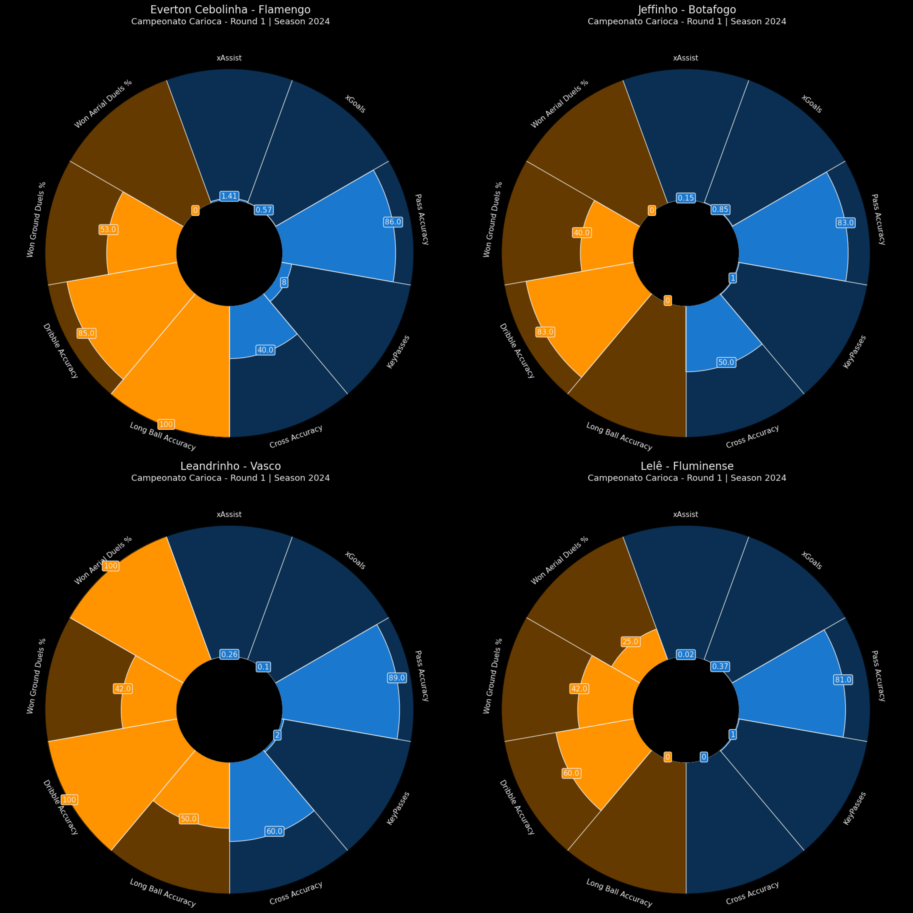
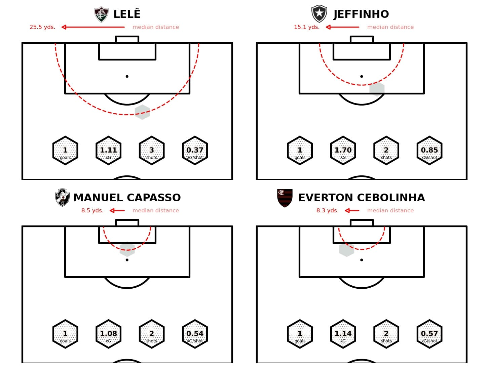

As the football fervor kicks into high gear, the iconic Campeonato Carioca takes center stage, captivating fans with its rich history and fierce competition. The opening round of this prestigious tournament has set the tone for a season filled with excitement, surprises, and gripping battles on the pitch.
The Campeonato Carioca is a prestigious football championship in Brazil, and the analysis of its first round in 2024 provides insights into the performance of participating teams. Let's delve into the key plots and observations from this tournament.

<strong>Data Overview</strong> 
The analysis relies on data extracted from the <a href="https://www.sofascore.com/tournament/football/brazil/carioca/92" target="_blank">SofaScore</a> website, a comprehensive resource for football statistics.

<strong>Matches</strong> 
The following matches were part of the first round: 

    

<h3>Decoding Football Dynamics</h3>
<h2>Ground Duels x Aerial Duels</h2>

<strong>Flamengo x Audax</strong>

In the riveting clash between Flamengo and Audax, the statistical tapestry provides a compelling narrative of individual performances and team dynamics. Let's delve into the intricacies of the ground and aerial duels, interceptions, and clearances to unravel the story behind Flamengo's convincing 4-0 victory. 
  

<strong>Ground Duels and Aerial Battles: Patrick's Dominance and Audax's Aerial Struggle</strong> 

    

The graphical representation of ground duels reveals Patrick from Audax as a standout performer, showcasing exceptional prowess by winning a total of 14 challenges.  On the aerial front, it was Fabricio Bruno of Flamengo who soared above the rest, asserting dominance in aerial duels. However, a notable observation is Audax's struggle in the air, winning only 2 aerial duels.  This disparity in aerial efficiency potentially played a role in the 4-0 outcome, with Flamengo capitalizing on their aerial prowess.

<strong>Interceptions vs. Clearances: Defensive Showcases</strong>

Shifting our focus to defensive actions, Paulo Victor of Audax emerges as a defensive stalwart with an impressive tally of 5 clearances.  Igor and João Victor de Sousa also showcased defensive resilience with 4 clearances each. On the Flamengo side, defensive actions were not as frequent, emphasizing the team's control of the game.  Guillermo Varela's interceptions and Fabricio Bruno's clearances stood out, showcasing the team's efficiency in halting Audax's advances.

 

<strong>Result Reflection: The Disparity in Numbers</strong> 
The stark contrast in the defensive numbers between Audax and Flamengo is reflective of the 4-0 scoreline.  Audax's struggle in both ground and aerial duels, coupled with the defensive prowess of Flamengo's players, contributed to the convincing victory.  Patrick's standout performance in ground duels couldn't translate into a collective effort for Audax, while Flamengo's defensive solidity, as indicated by fewer defensive actions needed, underscored their dominance on the pitch.

 

<strong>Fluminense x Volta Redonda</strong>

The clash between Fluminense and Volta Redonda unraveled a tale of strategic duels and defensive fortitude, painting a picture of a hard-fought match that ended in a closely contested result.  

    

<strong>Ground Duels and Aerial Battles: Wellington Silva's Impact for Volta Redonda</strong> 

In the graphical representation, the prowess of Wellington Silva from Volta Redonda shines through, dominating both ground and aerial duels. His success in duels, coupled with noteworthy contributions from João Neto and So Isaac for Fluminense, underscores the individual battles that shaped the course of the game.  Additionally, Bruno Barra's excellence in aerial duels for Volta Redonda, countered by Antonio Carlos for Fluminense, adds depth to the strategic contest. The overall dominance of Volta Redonda in aerial duels hints at their aerial superiority, a crucial factor in the match dynamics.

<strong>Interceptions vs. Clearances: Defensive Showcase</strong>

The defensive graph showcases Antonio Carlos from Fluminense as a standout performer, particularly in the clearance department. His ability to thwart Volta Redonda's advances and maintain defensive stability becomes evident through the sheer number of clearances. The balanced defensive actions from both teams reflect the closely contested nature of the match, where each side had to be resilient to prevent conceding goals.

 

<strong>Result Analysis: A Hard-Fought Battle with a Narrow Outcome</strong> 
The equilibrium in defensive actions, coupled with individual brilliance in duels, paints a picture of a hard-fought encounter resulting in a closely contested score.  While Antonio Carlos's defensive prowess stood out for Fluminense, Volta Redonda's success in aerial duels, led by Bruno Barra, contributed to the evenly matched nature of the game.  The 1-0 victory by Fluminense suggests that every defensive action and tactical duel played a crucial role in shaping the final outcome.

 

<strong>Vasco x Boa Vista</strong>

Vasco and Boa Vista unfolded as a testament to Vasco's strategic prowess, securing a 2-0 victory. Let's delve into the tactical nuances revealed by the ground duels, aerial battles, interceptions, and clearances, highlighting key players and their impactful contributions.  

    

<strong>Ground Duels and Aerial Battles: Matheus Alessandro's Resilience and Vasco's Aerial Dominance</strong> 

In the graphical representation, Matheus Alessandro from Boa Vista emerges as a standout performer in ground duels, showcasing a remarkable success rate and dominating this aspect of the game.  On the flip side, Vasco's aerial dominance is evident through the noteworthy performances of Miranda and Manuel Capasso.  Their proficiency in aerial duels played a crucial role in Vasco's control of the match, contributing to the 2-0 victory.

<strong>Interceptions vs. Clearances: Defensive Brilliance from Manuel Capasso and Sheldon</strong>

Manuel Capasso's defensive prowess shines through in the clearance department, with the highest number of clearances in the match.  His ability to thwart Boa Vista's attacks and provide a solid defensive foundation for Vasco is a key insight into his defensive capabilities.  On the Boa Vista side, Sheldon's notable level of interceptions indicates his effectiveness in disrupting Vasco's offensive plays.

 

<strong>Result Analysis: Defensive Excellence and Aerial Superiority</strong> 
The comprehensive victory for Vasco is reflected in the tactical statistics.  Matheus Alessandro's ground duels prowess for Boa Vista was remarkable, but it wasn't enough to break through Vasco's defensive resilience.  The aerial battles, led by Miranda and Manuel Capasso, showcased Vasco's dominance in the air, contributing to both offensive and defensive phases of the game.

 

<strong>Botafogo x Madureira</strong>

In a hard-fought encounter, Botafogo clinched a narrow 1-0 victory over Madureira.  This analysis aims to spotlight key players and their pivotal contributions that shaped the outcome of this closely contested duel.  

    

<strong>Ground Duels: Arthur Santos and Segovia's Battle</strong> 

Arthur Santos of Madureira stood out as the most successful player in ground duels, showcasing an impressive ability to win challenges in the close-quarter battles on the pitch.  Following closely, Segovia from Botafogo demonstrated his prowess in ground duels.  The intense duel between these players in the middle of the field became a defining aspect of the match, shaping the flow of possession and control.

<strong>Aerial Duels: Botafogo's Dominance in the Air</strong>

Botafogo showcased aerial superiority, with Eduardo and Danilo Barbosa emerging as dominant figures in the aerial battles. Their success in the air, combined with Arthur Edeson's commendable performance for Madureira, contributed to the overall narrative of Botafogo's control in the skies.  The competitive duel between Arthur Edeson and Botafogo's aerial forces added an intriguing layer to the match dynamics.

 

<strong>Interceptions vs. Clearances: Defensive Equilibrium</strong> 
In the graphical representation of interceptions and clearances, a sense of defensive balance emerges.  Arthur Edeson from Madureira and Lucas Halter from Botafogo both stood out with the same number of clearances, showcasing their defensive resilience.  Notably, Matheus Lira of Madureira displayed a stellar performance in interceptions, showcasing his ability to disrupt Botafogo's offensive plays.

 
<strong>Result Analysis: Defensive Brilliance and Narrow Margins</strong> 
The closely contested 1-0 victory for Botafogo finds its roots in the tactical battles fought on the ground and in the air.  Arthur Santos' ground duels success for Madureira and Arthur Edeson's defensive contributions provided a solid foundation.  However, Botafogo's aerial dominance, coupled with a balanced defensive effort, allowed them to secure the narrow win.  The equilibrium in defensive actions, highlighted by interceptions and clearances, underlines the tightly contested nature of the match.

 

<h1>Best Players of each team</h1> 
As we delve into the realm of sports analysis, our focus shifts to the standout performers, the engines that propel their teams to greatness.  Join us on a journey to unravel the stories behind the best players of each team, dissecting their contributions, highlighting their key strengths, and celebrating the impact they bring to the beautiful game.  This analysis aims to showcase and appreciate the skills, dedication, and moments of brilliance that make these players the heartbeat of their respective squads.

    

<ol>
    <li align="justify"><strong>xAssist (Expected Assists):</strong> The representation of xAssists in the radar plot serves as an indicator of your ability to create goal-scoring opportunities. This metric evaluates the likelihood of an assist based on the quality of your passes.</li>
    <li align="justify"><strong>xGoals (Expected Goals):</strong> xGoals offer a glimpse into your goal-scoring potential. This metric considers the quality and positions of your shots, providing a predictive measure of the likelihood of scoring.</li>
    <li align="justify"><strong>Pass Accuracy:</strong> Your pass accuracy is a fundamental aspect of your playmaking ability. A high pass accuracy percentage suggests precision in distributing the ball, contributing to team possession and strategic build-up.</li>
    <li align="justify"><strong>Key Passes:</strong> Key passes quantify your ability to make impactful passes that directly lead to goal-scoring opportunities. This metric highlights your creativity and vision on the field.</li>
    <li align="justify"><strong>Cross Accuracy:</strong> Cross accuracy assesses your effectiveness in delivering accurate crosses into the box. A high cross accuracy percentage indicates proficiency in providing goal-scoring opportunities from wide positions.</li>
    <li align="justify"><strong>Long Ball Accuracy:</strong> Long ball accuracy measures your success in executing long-range passes. This skill is valuable for quickly transitioning from defense to attack and unlocking opposing defenses.</li>
    <li align="justify"><strong>Dribble Accuracy:</strong> Dribble accuracy reflects your success rate in one-on-one dribbling situations. A high dribble accuracy showcases your ability to navigate through opposition players, creating space and advancing play.</li>
    <li align="justify"><strong>Won Ground Duels %:</strong> This metric evaluates your success rate in ground duels, showcasing your ability to secure possession in contested situations on the ground.</li>
    <li align="justify"><strong>Won Aerial Duels %:</strong> The percentage of won aerial duels highlights your effectiveness in aerial challenges. This skill is crucial in both defensive and offensive situations, particularly during set-piece plays.</li>
</ol>

<strong>Players' Shooting Analysis</strong>

In our analysis of the goal-scoring prowess of the two standout performers in the recent round of the 2024 Campeonato Carioca, we've focused on key metrics such as goals scored (G), expected goals (xG), total shots taken, and the xG per shot ratio.  Let's delve into the performance metrics of the top two performers and draw insights from their impressive displays.

<ol>
    <li align="justify"><strong>Goals Scored (G):</strong> The G metric serves as a testament to the players' effectiveness in converting goal-scoring opportunities into tangible results. It reflects their ability to deliver in crucial moments and make significant contributions to their team's success.</li>
    <li align="justify"><strong>Expected Goals (xG):</strong> The xG metric provides valuable insights into the quality of chances created and taken by each player. A high xG suggests that their goal-scoring prowess is not merely a result of chance but rather a product of consistently creating high-quality opportunities. This metric underlines their strategic positioning and finishing abilities.</li>
    <li align="justify"><strong>Total Shots Taken:</strong> An analysis of the total shots taken by both players sheds light on their assertiveness in front of goal. A high shot count, when coupled with a high conversion rate, indicates a clinical and prolific goal-scoring performance. The players' offensive contributions are evident in their willingness to take on goal-scoring responsibilities.</li>
    <li align="justify"><strong>xG per Shot:</strong> The xG per shot ratio is a crucial metric that gauges the efficiency of each player in converting goal-scoring opportunities. A high xG per shot indicates a player's ability to maximize the quality of chances, making each shot count. It reflects their precision and effectiveness in front of goal.</li>
</ol>

To base our analysis, we bring a shoot graph of the two best shooters of the first round:

    

### Comparative Analysis:

- Both players showcased an impressive conversion of goal-scoring opportunities, as reflected in their high G and xG metrics. This consistency highlights their reliability as key contributors in the attacking phase.
- The xG per shot ratio provides insights into the effectiveness of their decision-making in front of goal. It showcases their ability to make strategic choices, maximizing the expected value of each attempt.
- The total shots taken by both players illustrate not only their offensive contributions but also their proactive approach to goal-scoring responsibilities. Their willingness to take on shots contributes significantly to the team's attacking prowess.

In summary, the goal-scoring performances of these two players stand out prominently in the recent round of the Campeonato Carioca. Their ability to convert chances, strategic decision-making, and offensive contributions underline their importance as key figures in the pursuit of success. As we bring forth this comparative analysis, it becomes evident that these two players have been at the forefront of goal-scoring excellence in the competition.

In conclusion, the recent Campeonato Carioca round is a testament to their offensive impact. The combination of clinical finishing, strategic shot selection, and consistent creation of high-quality chances solidifies their positions as key contributors in the pursuit of success.

- Data for some teams was not available when composing this analysis.  - Our Analysis is focused on the 4 bigger teams from Rio de Janeiro (Botafogo, Flamengo, Fluminense, Vasco)

We hope you enjoyed this insightful analysis of the Campeonato Carioca, gaining valuable insights into the intricate dynamics of football networks. Feel free to share your thoughts and questions.

